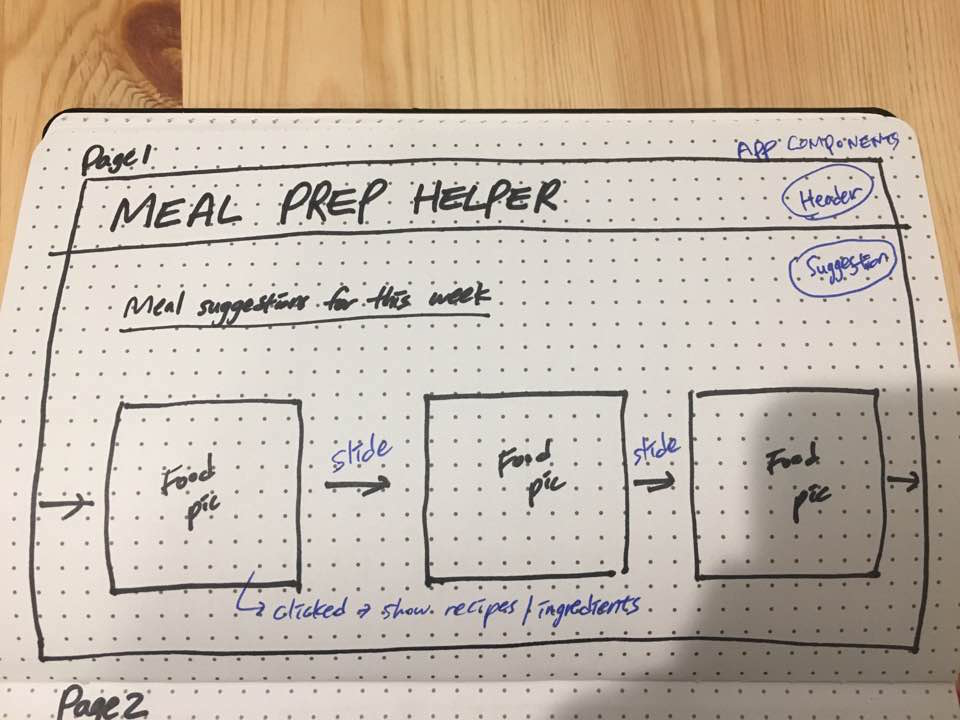
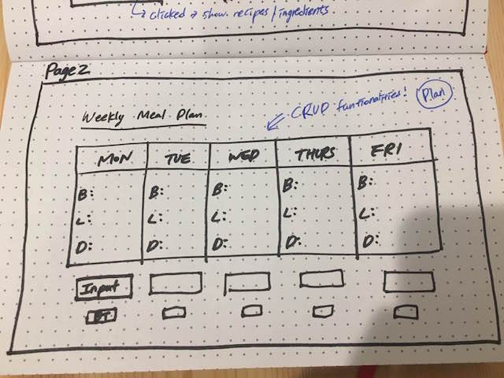
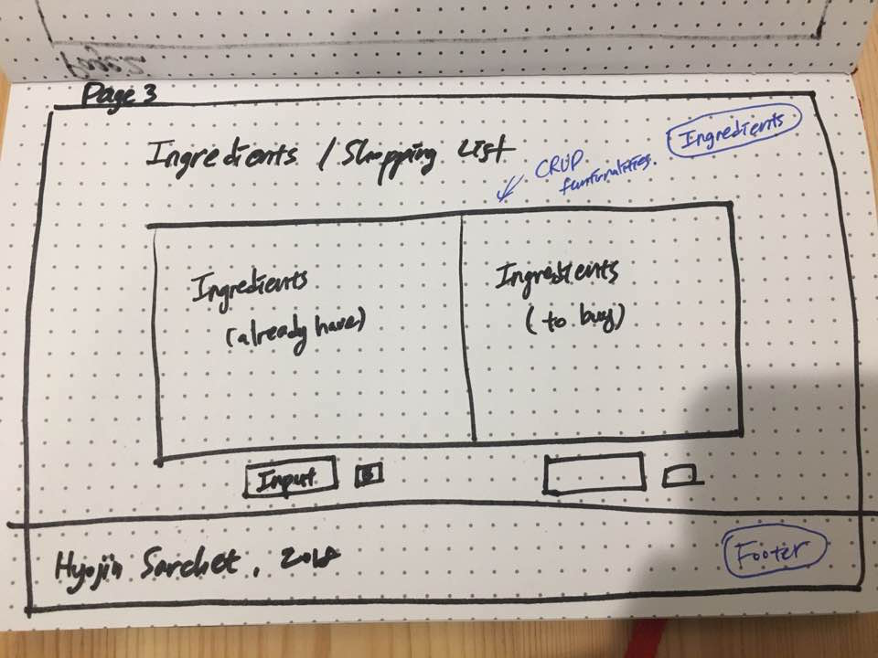

# Planning the 'Meal-Prep-Helper' project

### About the project:

* It is the React application.
* It has complete CRUD functionality implemented with RESTful routes.
* This application is deployed to Surge.

### What I am building:

This is a Meal-Prep-Helper app. It has the following features:

* Create a daily(Monday to Friday) meal plan.
* View my stored meal plans.
* Edit a meal plan.
* Delete a meal plan.

### User stories / List of Features

* As a User, I want to create and save my meals, so that I can plan ahead what kind of meals I will eat for a week.
* As a User, I want to read/see my meals, so that I can prepare and check what meals I am eating daily.
* As a User, I want to edit my meals, so that I can change my meals plan freely.
* As a User, I want to delete my meals, so that I can control my meals easily.

### MVP

* Ability to see suggestion images and meal plans.
* Ability to create meal plans.
* Ability to edit meal plans.
* Ability to delete meal plans.

### Bronze

* Ability to display the meal suggestion images.
* Ability to make the meal suggestion images clickable.
* Ability to list recipes and ingredients when the meal suggestion images are clicked.

### Silver

* Ability to track and compare my drink selection with other people's.
* User profile showing their drink history.
* User profile showing their daily caffeine consumption on a graph.

### Gold

* Ability to make CRUD functionality on the meal list using back-end.
* Ability to make CRUD functionality on the ingredient list using back-end.
* Ability to make comment section.

### Used tools in the project

| Tools |
| :---: |
| React |
| Html  |
|  CSS  |

### Wireframes

